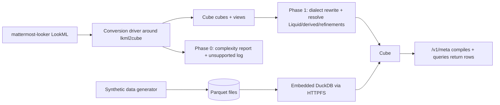
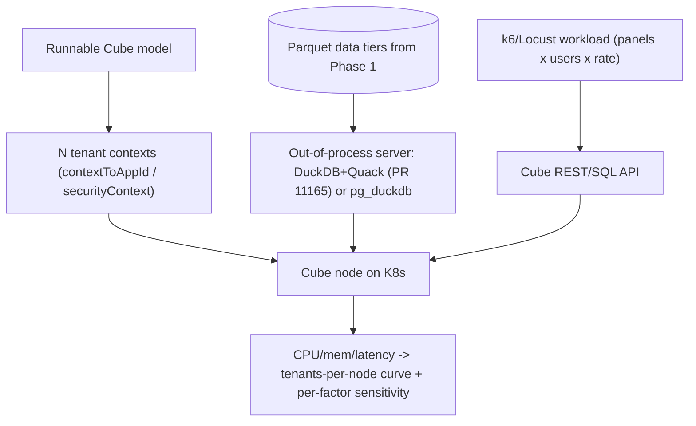
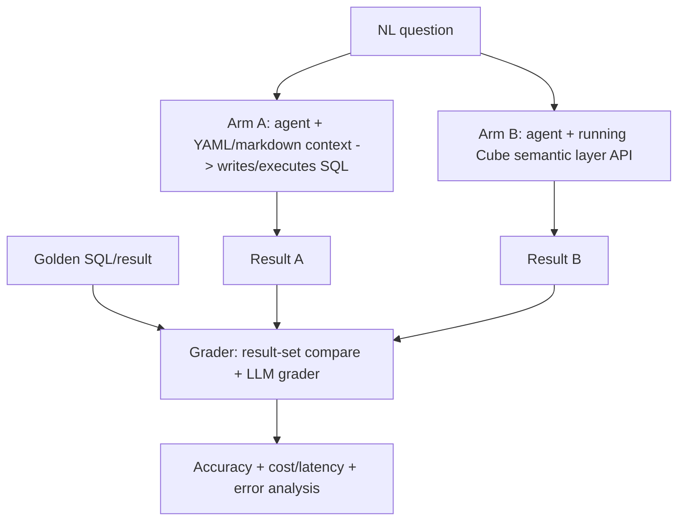

# Mattermost-Looker to Cube: Full Runnable Conversion + Two Projects

The shared foundation is a full, runnable conversion of the entire LookML project onto DuckDB + Parquet, output into this `cube/` directory. Two projects build on it.

This is a working plan; it will evolve as the work proceeds.

## Decisions (locked)

- Fidelity: full runnable conversion of the entire project (iterate `lkml2cube` + manual fixes until everything runs). This is the long pole, driven mainly by Project 2.
- Location: this `cube/` directory inside the mattermost-looker repo.
- Engine: DuckDB. Synthetic data is published as Parquet (engine-agnostic, shareable in a fork so others can benchmark).
- Serving topology:
  - Phase 0/1 + eval (Project 2): embedded DuckDB reads Parquet via Cube's built-in HTTPFS. Compute-in-process is fine because the eval measures answer quality, not capacity.
  - Project 1 load test (deferred): out-of-process serving so warehouse CPU/RAM is not conflated with Cube. Primary = Quack (DuckDB client-server), enabled by PR [cube-js/cube#11165](https://github.com/cube-js/cube/pull/11165) (migrates Cube's driver to `@duckdb/node-api` / DuckDB 1.5.4). Fallback = pg_duckdb (Postgres wire). Quack stays off the critical path (beta until DuckDB 2.0; unmerged PR = self-built image).
- Project 1: now just convert + produce a model-complexity report; load harness designed in a later phase.
- Project 2: build a bespoke NL -> golden SQL/result benchmark, graded by result-set comparison + LLM grader.

## What we're working with (measured)

- ~250 LookML files: ~245 views, ~153 explores across 7 `.model.lkml` files; main [data_warehouse.model.lkml](../models/data_warehouse.model.lkml) is 145 KB with 100 explores.
- ~25-30 distinct Snowflake source schemas (FINANCE, ORGM, EVENTS, MART_PRODUCT, STRIPE, BLAPI, BLP, CS, SNOWFLAKE.ACCOUNT_USAGE, ...).
- Hard-to-convert LookML: Liquid `` (~15 files), derived tables (~10 views), `extends`/refinements/`extension: required` explores, manifest `constant:`s in [manifest.lkml](../manifest.lkml).
- Full-runnable on DuckDB additionally means: rewriting Snowflake SQL (quoted-uppercase identifiers, `div0()`, `::casts`, `fiscal_month_offset: -11`, `week_start_day: sunday`) and synthesizing referentially-consistent Parquet data for every source table.

## Phase 0 - Parse + complexity report (fast; delivers Project 1 now)

1. Scaffold `cube/`: `model/` (output), `scripts/convert.py`, `data/` (synthetic Parquet, gitignored), `docker-compose.yml`, `reports/`, `README.md`.
2. Fix `lkml2cube` include recursion: in `lkml2cube/parser/loader.py` `file_loader`, use `glob.glob(file_path_input, recursive=True)` so `/**/**/*.view.lkml` reaches deep views (`views/marts/product/`, `views/reports/docs/`). Update docstring + run `python scripts/generate_docs.py`.
3. Write `scripts/convert.py` (LookMLConverter API): preload [manifest.lkml](../manifest.lkml) for `@{constant}` resolution; clear the loader cache between runs; loop all 7 model files with `rootdir` = repo root; dedupe cubes by name; log all "Key not supported yet"/parse warnings to `reports/unsupported.log`.
4. Generate `reports/complexity.md`: counts of cubes, dimensions, measures, joins, Cube views, distinct source schemas/tables, and a categorized list of unsupported constructs.

Deliverable: parsed Cube model (not yet runnable) + complexity/warehouse-size report + unsupported-construct log. No warehouse needed.

## Phase 1 - Full runnable conversion on DuckDB + Parquet (the long pole)

1. Engine + infra: `docker-compose` with Cube + its embedded DuckDB, reading the Parquet files via the built-in HTTPFS extension (no separate warehouse process needed for dev/eval).
2. Synthetic data: generator that reads each view's `sql_table_name` + columns and writes referentially-consistent fake data to **Parquet** (the shareable artifact), with scale knobs (also seeds Project 1's later row-count tiers).
3. Dialect rewrite: Snowflake -> DuckDB - identifier quoting/case, `div0()` -> `NULLIF` division, `::type` casts, fiscal offset / week-start, and remaining Snowflake functions.
4. Resolve unsupported LookML: Liquid (translate/parameterize), derived tables (-> Cube `sql` cubes / materialized views), `extends` + refinements + `extension: required` explores (flatten into Cube views/inheritance).
5. Verify runnable in priority domain order (finance, orgm, product, events first; long tail like `snowflake_usage` / `dbt_project_evaluator` last) until `/v1/meta` compiles and a representative query on every cube returns rows; track % coverage.

Deliverable: a fully runnable Cube semantic layer over synthetic Parquet data.

## Project 1 - Cube tenant-density (report now, harness later)

Now: the Phase 0 complexity/warehouse-size report answers "how large/complex is the model" and frames the four density factors (model size, rows/table, query complexity+breadth, request volume).

Later (deferred): design the load harness. Serving layer must be out-of-process (embedded DuckDB would conflate warehouse CPU/RAM with Cube and saturate the node sooner): primary = a Quack-enabled Cube image (PR [cube-js/cube#11165](https://github.com/cube-js/cube/pull/11165)) attaching a remote DuckDB server over the `quack:` protocol; fallback = pg_duckdb over the Postgres wire. Smoke-test the custom image before trusting capacity numbers.

## Project 2 - Semantic layer vs. raw SQL (A/B for an analyst agent)

Goal: test whether an analyst agent produces better results when it can query a running semantic layer (Cube) vs. when it only has the semantic config as YAML/markdown context and must write+run SQL. Grounded in the Hex "golden workflow", Datost, and OpenAI data-agent posts (context layers + result-set-graded evals).

1. Runnable semantic layer: provided by Phase 1 (entire project). Add a markdown knowledge/context layer (metric definitions, descriptions, lineage) - the "context layers" idea from the OpenAI post.
2. Benchmark: build NL question -> golden SQL/result pairs over this schema; grade by result-set comparison + an LLM grader (OpenAI Evals-style), not string match.
3. Agent harness, one agent with two tool configs over the same data/questions/prompts:
   - Arm A: warehouse SQL execution + retrieval over the YAML/markdown semantic config.
   - Arm B: Cube REST/SQL API (measure/dimension queries) + optional SQL fallback (the "golden workflow").
   - Optionally Arm C: both available, to test the cross-check behavior the Hex post highlights.
4. Run N trials/question/arm; score accuracy + secondary metrics (latency, tokens/cost, self-corrections, hallucinated columns); test significance.
5. Analyze: when the semantic layer helps/hurts, the knowledge-layer contribution, and failure modes.

Deliverable: A/B result with significance + qualitative findings on whether the running semantic layer beats SQL-from-config.

## Prioritization

- Phase 0 is cheap and immediately delivers Project 1's report - do it first.
- Phase 1 (full runnable on DuckDB) is the single biggest line item and is driven by Project 2. Do it in priority domain order with checkpoints. The long tail (`snowflake_usage` system tables, `dbt_project_evaluator` marts, `experimental`, `qa` telemetry) is low ROI for the eval - convert it last; can be time-boxed/dropped without hurting Project 2.
- Project 2 (benchmark + harness) can start on high-value domains as soon as Phase 1 covers them - it doesn't need the long tail finished.
- Project 1's load harness is deferred; when picked up it reuses Phase 1's Parquet data + the out-of-process serving layer (Quack image / pg_duckdb).

## Key risks / open decisions

- Engine decided (DuckDB) and serving topology decided (embedded for dev/eval; out-of-process Quack/pg_duckdb for the deferred load test). Quack risk: beta until DuckDB 2.0 and PR #11165 is unmerged, so it relies on a self-built Cube image - keep off the critical path and smoke-test before load runs; pg_duckdb is the fallback.
- Full-runnable on DuckDB is large: dialect rewrite + Liquid/derived-table/refinement translation + synthetic Parquet for ~30 schemas. Mitigation: priority-ordered conversion; long tail optional.
- Public-repo hygiene: `mattermost-looker` is PUBLIC. Keep creds out; `.gitignore` generated Parquet/data; use a personal fork for any push.
- Multi-model dedup: the 7 models share view includes; keep one cube set and aggregate only explore-derived Cube views.
- Project 2 ground truth remains the crux; build the benchmark on high-value domains first.

## Task checklist

- [ ] Scaffold `cube/` (model/, scripts/, data/, docker-compose.yml, reports/, README; .gitignore generated data + any creds)
- [ ] Patch `lkml2cube` `file_loader` to `glob(recursive=True)`; update docstring + regenerate docs
- [ ] Write `scripts/convert.py`: preload manifest constants, clear cache, loop all 7 models, dedupe cubes, log unsupported constructs
- [ ] Generate model complexity + warehouse-size report (Project 1 deliverable; no warehouse needed)
- [ ] Stand up Cube + embedded DuckDB reading Parquet via HTTPFS (docker-compose); wire the datasource
- [ ] Build a synthetic-data generator that outputs Parquet for all source tables/schemas, with scale knobs
- [ ] Build Snowflake -> DuckDB SQL rewrite (identifier quoting/case, div0->NULLIF, ::casts, fiscal/week-start, funcs)
- [ ] Translate Liquid, derived tables, and extends/refinements/extension-required explores into runnable Cube
- [ ] Iterate in priority domain order until /v1/meta compiles and a representative query returns rows on every cube; track % coverage
- [ ] Project 1 (deferred): design load harness - out-of-process serving via Quack image (PR #11165) or pg_duckdb fallback, tenant contexts, k6/Locust, density sweep
- [ ] Project 2: add a markdown knowledge/context layer (metric defs, descriptions, lineage)
- [ ] Project 2: build NL -> golden SQL/result benchmark with result-set + LLM grading
- [ ] Project 2: build two-arm agent harness (SQL-from-config vs running Cube), run trials, analyze A/B results
